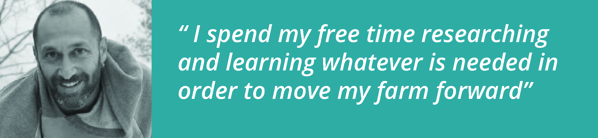
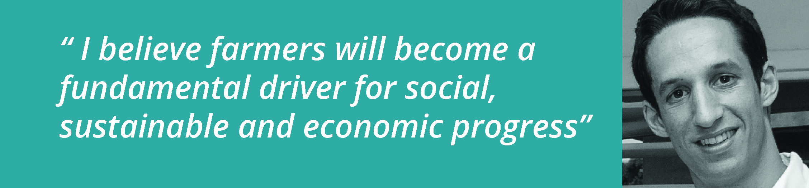
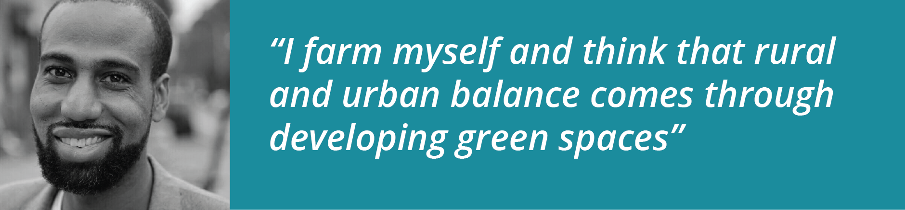

# Contact persons
### Project lead
#### Manolis Karamoussas

I started my own farm where I design and build everything from scratch. I have worked in almost every position in the residential construction field. I am self taught on CAD design  and I spend my free time researching and learning whatever is needed in order to move my farm forward, which led me to design a few machines from scratch, including the 1st prototypes of grapple,the cnc plasma, and the firewood processor.

#### Contact details
polemidis@gmail.com 
#### Location
Maine, USA

***

### Support
#### Jose Carlos Urra

I am an industrial designer working in peer-to-peer, cooperative business models, open source development, and sustainable development. I also have a lot of background in CAD modeling, UX design, web design and git. I support and empower makers with collaborative tools, processes and team dynamics. I believe farmers and producers can participate in innovation (today more than ever) and become a fundamental driver for social, sustainable and economic progress.

#### Contact details
jose.urra86@gmail.com
#### Location
Delft, Netherlands

***

### Outreach Development Coordinator
#### Rahim Davis

I am a neo industrialist working in sustainable energy, distributed networks, manufacturing and opensource tech. I have a large skill set in energy project management, sustainable farming and social marketing. I consult businesses that are looking to grow and specialize in implementing co-op strategies to help distribute local resources including education and workforce development and finance. I farm myself and think that rural and urban balance comes through developing green spaces.
#### Contact details
kwhefficiency@gmail.com
#### Location
New York, USA
