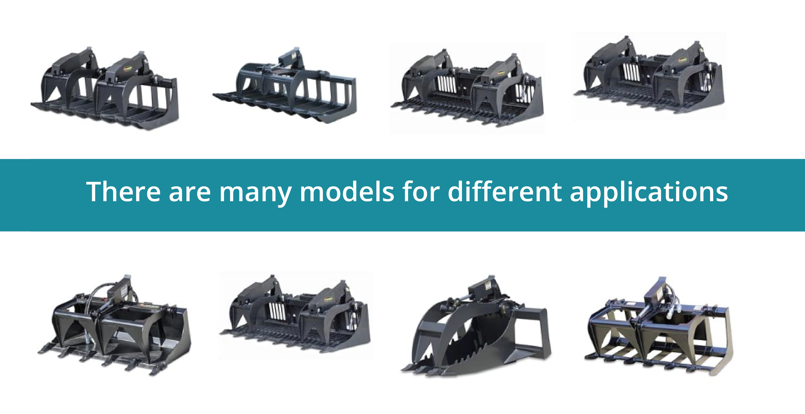

# Where to start?
# 
## Step 1: What kind of grapples design you need
#### This depends on your specific local needs. We can assist you, contact us!

## Step 2: Decide which of the following plans fits your expectations and needs

| Plans 👉   | No commitment   | Support the program for 10$/month for a year   | Get a DYI kit  | Ready to use  |
|:---:|:---:|:---:|:---:|:---:|
|  Price  | $0   | $120  | $800   | $1800  |
| 3D model  | **included**  | **included**  |  **included** |  **included** |
| DXF file  | **included**  | **included**  | **included**  |  **included** |
| Training and support  | not included  | **included**  | **included**  | **included**  |
| Cutted parts  | not included  | not included  | **included**  |  |
| Built machine  | not included  | not included  | not included  | **included**  |

These are the following options:
- Request for recommendation and support. The only thing you need to do is join the community and share your needs, thoughts, etc.
- You can order the parts if you are in the US and weld the Grapples on your own.
- We can host a collective workshop in Maine to lower costs, and also get good built quality.
- You can also get the files you need to order the parts to be cut out.
## Step 3: Arrange a price based on costs and fair work hours compensation
Our goal is to make impact and sustain ourselves, therefore we are transparent and hones in the costs behind our operations.  
